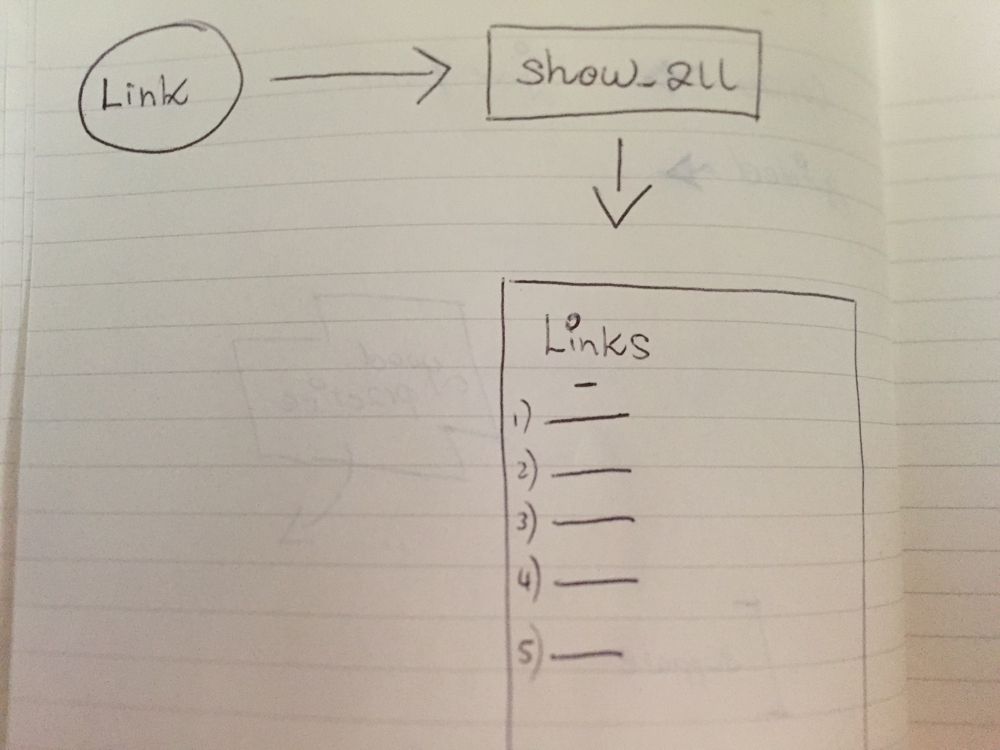

# Bookmark Manager

An application for storing all of your important links in one place.

## Aim of Learning

To test drive connection to a database manually, as oppose to using an ORM, and use that database connection to support an application.

## User Stories

```
As a user,
So that I can have all my important links in one place,
I want an application that shows a list of all my links.
```

## Domain Model Snapshot



## Installation

`git clone git@github.com:telgi/boomark-manager-revisited.git`

## How to Use

Run `ruby app.rb`

Navigate to `http://localhost:4567`

## How to Run Tests

Run `rspec spec/features` for feature tests

Run `rspec` for all tests, including unit tests

## Screenshot Example


## Author

Terry Allitt
