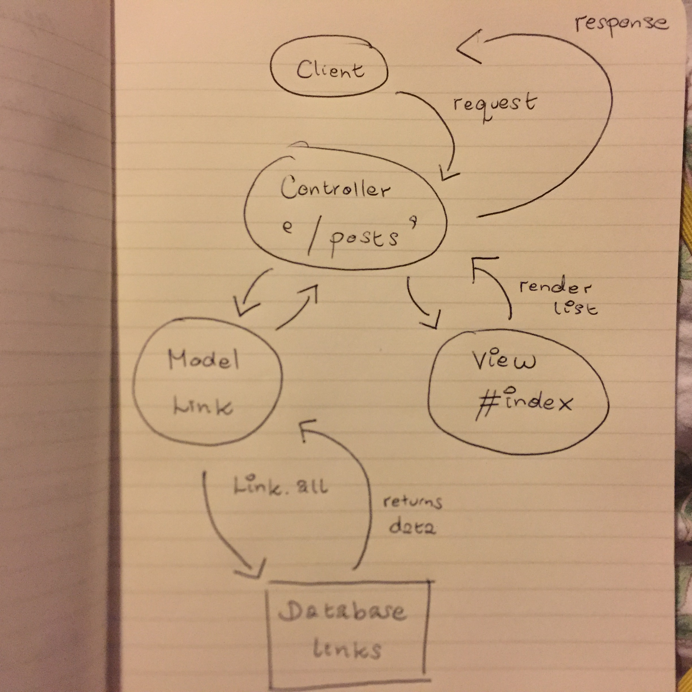

# Bookmark Manager

An application for storing all of your important links in one place.

## Aim of Learning

To test drive connection to a database manually, as oppose to using an ORM, and use that database connection to support an application.

## Installation

`git clone git@github.com:telgi/boomark-manager-revisited.git`

Run `bundle install` to install gem dependencies

Run `rake setup` to create test and development databases

## How to Use

Run `ruby app.rb`

Navigate to `http://localhost:4567`

## How to Run Tests

Run `rspec spec/features` for feature tests

Run `rspec` for all tests, including unit tests

## User Stories

```
As a user,
So that I can have easy access to all my regularly visited websites,
I want an application that stores a list of all these links.
```

```
As a user,
So that I can save a new link and easily reference that new link,
I want to be able to add the new link with the site's address and a title.

As a user,
So that I can get rid of links that I no longer need,
I want to be able to delete links from my list.

As a user,
So that I can edit the details of a link that has changed,
I want to be able to update any link in my list.
```

## Features

* The Bookmark Manager displays a list of links the user has added [x]
* The user can add a new link to their Bookmark Manager [x]
* The user can delete a link from their Bookmark Manager []
* The user can update a link in their Bookmark Manager []

## Screenshot Example


## Author

Terry Allitt
